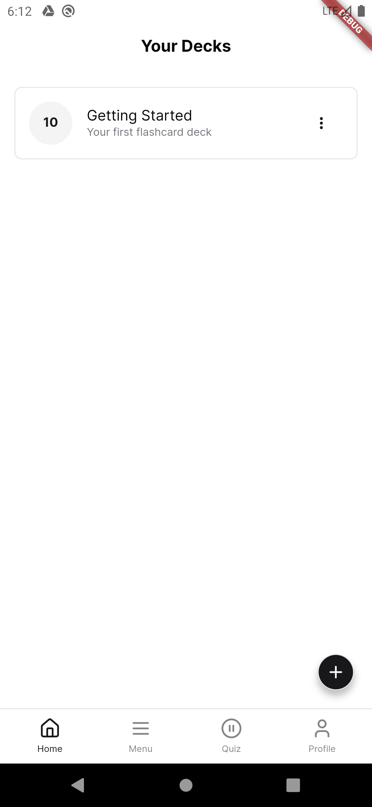
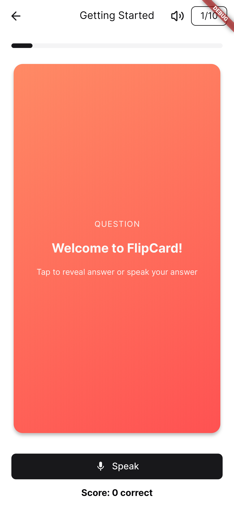
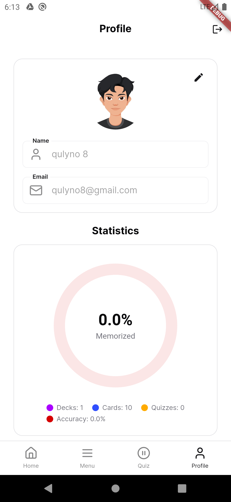

# Flipcard - Smart Flashcard Learning App


*A modern learning companion for effective memorization* 

## Features ✨

- 📚 **Deck Organization** - Create nested decks with custom categories
- 🔄 **Import/Export** - Share decks via JSON with media support
- 🧠 **Adaptive Quizzing** - Built-in spaced repetition algorithm
- 📊 **Progress Analytics** - Visual statistics of your learning progress
- 🌙 **Dark Mode** - Automatic theme switching based on system preferences

## Screenshots 📱

| Home | Quiz | Statistics |
|-------------|-----------|-----------|
|  |  |  |

## Installation Guide ⚙️ 

### Requirements  
- Flutter 3.32.4+ (Dart 3.8.1+)
- Android SDK 33+
- Supabase URL & ANON KEY
- Run Supabase SQL Editor [generated.sql](./generated.sql)

### Development Quick Start  
```bash
git clone https://github.com/fiqryx/flipcard.git

cd flipcard && flutter pub get

cp .env.example .env
```

```bash
SUPABASE_URL=your_supabase_url
SUPABASE_ANON_KEY=your_supabase_anon_key
```

```bash
flutter run -d chrome  # Web preview

flutter run            # Connected device
```

📥 <a href="./outputs/app-release.apk" download="Flipcard.apk">Download Latest APK</a>